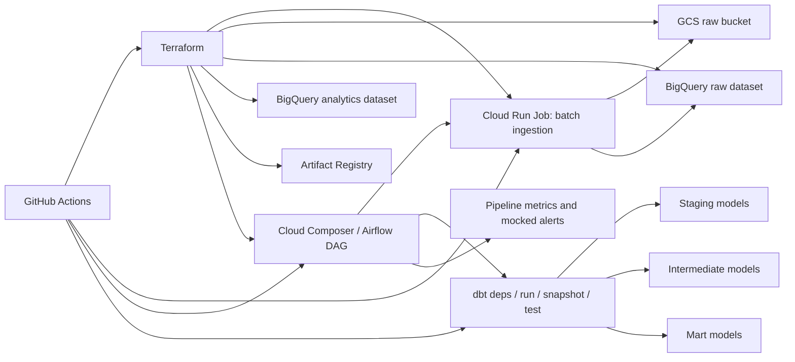

# gcp-iot-analytics-dbt

Production-style GCP data platform for IoT energy monitoring, built with Cloud Run Jobs, Cloud Composer, BigQuery, dbt, Terraform, and GitHub Actions.

This repository represents an end-to-end analytics platform for smart-building energy telemetry. It is designed to look and operate like a real delivery unit rather than a notebook-driven demo: ingestion is containerized, orchestration is explicit, infrastructure is provisioned as code, analytics models are tested, and deployment paths are separated by domain.

## Overview

The platform simulates batch ingestion of IoT energy events from distributed building devices and turns raw telemetry into analytics-ready datasets for operational monitoring and business reporting.

It focuses on the kinds of engineering concerns that matter in production environments:

- reliable orchestration across ingestion and transformation stages
- modular data platform design on GCP
- analytics engineering with layered dbt models
- infrastructure as code for repeatable provisioning
- CI/CD workflows aligned to repository domains
- data quality controls for imperfect upstream data
- cost-aware warehouse design using partitioning, clustering, and incremental processing

## Business context

Smart-building environments generate high-frequency telemetry from meters, sensors, and edge devices. That data is operationally valuable, but only if the platform can handle common real-world issues such as duplicates, nulls, delayed events, unstable device status, and the need to reprocess data without rebuilding everything from scratch.

This repository models that scenario with a production-oriented architecture:

- raw telemetry lands in low-cost object storage for replay and auditability
- ingestion is executed as an isolated batch workload
- analytics logic is managed separately from ingestion code
- orchestration coordinates dependencies, retries, and execution order
- curated marts expose energy KPIs and anomaly signals for downstream consumption

## Architecture



## Why this design

### Cloud Run Jobs for ingestion

The ingestion workload is finite, scheduled, and container-friendly, which makes Cloud Run Jobs a better fit than a long-running service. This keeps ingestion isolated, versioned, and independently deployable.

Trade-off: the platform takes on container build, image promotion, and runtime configuration management instead of relying on a simpler script-only execution model.

### Cloud Composer for orchestration

Composer was chosen to model a production-style orchestration layer with explicit task dependencies across ingestion, dbt execution, retries, and operational logging. It reflects the kind of tooling commonly used in larger data platforms.

Trade-off: Composer brings meaningful fixed cost and more operational overhead than lightweight serverless schedulers, but it improves credibility for enterprise-grade orchestration scenarios.

### BigQuery as warehouse and compute engine

BigQuery supports the storage and analytical access patterns required here while integrating well with GCS, Cloud Run, and dbt. Partitioning, clustering, and incremental model strategies help keep query cost under control.

Trade-off: warehouse cost discipline must be intentional. Poor partition filters or overly broad transformations can quickly increase scan volume.

### dbt for analytics engineering

dbt provides a clean separation between raw ingestion and analytical transformation. The project uses staging, intermediate, and mart layers, plus tests and snapshots, to demonstrate maintainable analytical modeling rather than ad hoc SQL.

Trade-off: dbt introduces an additional runtime dependency that must be installed and versioned in Composer.

### Terraform for platform provisioning

Infrastructure is defined as code so the platform can be reproduced, reviewed, and evolved through standard engineering workflows rather than manual console setup.

Trade-off: Terraform adds lifecycle management overhead, but it strengthens repeatability, traceability, and operational maturity.

## Repository structure

```text
.
|-- .github/
|   `-- workflows/
|-- composer/
|   |-- dags/
|   |   `-- gcp_iot_analytics_dbt/
|   |       |-- iot_energy_pipeline.py
|   |       `-- dbt_project/
|   |-- plugins/
|   `-- data/
|-- docs/
|-- infra/
|   `-- terraform/
`-- integrations/
    `-- iot_energy_ingestion/
```

### Structure by delivery domain

- `integrations/`
  Containerized ingestion code intended for execution outside Composer, with its own dependencies, tests, and image lifecycle.
- `composer/`
  The deployment artifact synced to the Composer bucket, including DAGs and the dbt project used by orchestration.
- `infra/terraform/`
  Infrastructure definitions for storage, compute, IAM, warehouse, and orchestration resources.
- `.github/workflows/`
  CI/CD workflows split by concern so changes can be validated and deployed selectively.
- `docs/`
  Supporting architecture notes and implementation rationale.

## Data flow

1. A Cloud Composer DAG schedules the daily pipeline execution.
2. Composer triggers a Cloud Run Job dedicated to batch ingestion.
3. The ingestion job generates IoT telemetry with intentionally realistic data quality issues such as duplicates, nulls, negative values, and late-arriving records.
4. Raw JSONL files are persisted to GCS as a replayable landing layer.
5. The same job appends raw events to a partitioned BigQuery dataset.
6. Composer executes `dbt deps`, `dbt run`, `dbt snapshot`, and `dbt test`.
7. dbt transforms raw events into cleaned staging models, reusable intermediate models, and business-facing marts.
8. The pipeline emits operational logs and mocked observability signals.

## Analytics model layers

The dbt project follows a layered design to improve maintainability and reduce coupling between ingestion behavior and downstream analytics logic.

- `staging`
  Standardizes field names, typing, deduplication logic, and status normalization for raw IoT events.
- `intermediate`
  Encapsulates reusable business logic such as hourly energy rollups and daily data quality metrics.
- `marts`
  Publishes analytics-ready outputs, including building-level energy KPIs and anomaly detection views.
- `snapshots`
  Tracks slowly changing device status history.
- `tests`
  Combines schema tests with custom SQL assertions for non-negative energy, null-ratio thresholds, and recent-data checks.

## Operational flow

The main DAG is defined in `composer/dags/gcp_iot_analytics_dbt/iot_energy_pipeline.py` and orchestrates the platform in a linear, production-readable order:

1. run ingestion job in Cloud Run
2. install dbt dependencies
3. build transformation models
4. snapshot mutable status data
5. run data quality tests
6. emit pipeline metrics and mocked alerts

This sequencing intentionally favors operational clarity over unnecessary DAG complexity.

## Infrastructure

Terraform provisions the core platform components:

- GCS raw bucket with lifecycle policy for lower-cost archival storage
- BigQuery raw dataset
- BigQuery analytics dataset
- Artifact Registry repository for ingestion images
- Cloud Run Job for ingestion execution
- Cloud Composer environment for orchestration
- service accounts and IAM bindings for workload separation

The infrastructure design demonstrates awareness of runtime boundaries and least-privilege responsibilities between ingestion and orchestration layers.

## CI/CD

The repository includes domain-oriented GitHub Actions workflows:

- `python-ci.yml`
  Runs unit tests for the ingestion code and performs a Python syntax smoke check.
- `dbt-ci.yml`
  Installs dbt, validates project structure, compiles models, and generates docs metadata.
- `terraform.yml`
  Runs `terraform fmt`, `terraform init -backend=false`, and `terraform validate`.
- `iot-energy-ingestion-image.yml`
  Builds the ingestion container image, pushes it to Artifact Registry, and updates the Cloud Run Job image.
- `composer-sync.yml`
  Syncs the `composer/` deployment artifact to the Composer bucket.

This separation is intentional: code paths can evolve independently, and release activity stays closer to the relevant delivery domain.

## Data quality and observability

The project is designed to show how a platform handles imperfect operational data instead of assuming ideal inputs.

Simulated upstream issues include:

- duplicate events from retransmission
- null measurements
- negative energy values
- delayed event arrival
- intermittent offline device status

Implemented controls include:

- dbt schema tests
- custom SQL assertions
- retries at the orchestration layer
- unit tests for ingestion behavior
- structured raw persistence for replay and forensic analysis
- pipeline log emission and mocked alert hooks

## Cost-awareness

The warehouse and storage design reflect common cloud cost controls:

- partitioned BigQuery tables on event date
- clustering on high-value access keys such as `building_id` and `device_id`
- incremental processing patterns with reprocessing windows for late-arriving data
- GCS as a lower-cost raw persistence layer
- selective CI/CD by repository path to avoid unnecessary deployment work

One intentional trade-off is the use of Composer. It improves orchestration realism and enterprise fit, but it is also the largest fixed-cost component in the architecture.

## Local development

### Prerequisites

- Python 3.11+
- Docker
- `dbt-bigquery`
- Google Cloud credentials with access to GCS and BigQuery
- environment variables:
  - `GCP_PROJECT_ID`
  - `GCP_REGION`
  - `BQ_DATASET_RAW`
  - `BQ_DATASET_ANALYTICS`
  - `GCS_RAW_BUCKET`

### Run ingestion locally

```powershell
cd integrations/iot_energy_ingestion
python -m venv .venv
.venv\Scripts\Activate.ps1
pip install -r requirements.txt
python run_ingestion.py --execution-date 2026-04-26T10:00:00 --output-dir data
```

### Build the ingestion image

```bash
cd integrations/iot_energy_ingestion
docker build -t us-central1-docker.pkg.dev/<project-id>/iot-platform/iot-ingestion:latest .
```

### Validate dbt locally

```bash
cd composer/dags/gcp_iot_analytics_dbt/dbt_project
pip install dbt-bigquery
dbt deps --profiles-dir .
dbt debug --profiles-dir .
dbt run --profiles-dir .
dbt snapshot --profiles-dir .
dbt test --profiles-dir .
dbt docs generate --profiles-dir .
```

### Deploy to Composer

Sync the `composer/` directory to the Composer bucket while preserving the `dags/`, `plugins/`, and `data/` layout. The Composer environment must install the dependencies listed in `composer/requirements-composer.txt`.

## Trade-offs and limitations

- Composer increases architectural realism and orchestration capability, but it is expensive compared with lighter scheduling options.
- The current observability step emits mocked metrics and mocked alerts rather than integrating directly with Cloud Monitoring or PagerDuty-style channels.
- dbt CI validates structure and compilation, but it does not run warehouse-backed integration tests against a live BigQuery environment.
- The container deployment workflow is tailored to the current ingestion job; a larger platform with many integrations would likely evolve to a matrix-based or generated deployment strategy.
- The Terraform definition assumes required APIs, quotas, and network configuration are available in the target GCP account.

## What this project demonstrates

This repository is positioned as a portfolio asset for senior data engineering work. It demonstrates:

- hands-on cloud data platform implementation on GCP
- orchestration across ingestion, transformation, testing, and operational signaling
- analytics engineering with dbt layer design, snapshots, and custom tests
- infrastructure as code for reproducible platform provisioning
- CI/CD aligned to repository boundaries and runtime responsibilities
- production-aware thinking around reliability, maintainability, and cloud cost
- business-oriented design that turns telemetry into usable operational KPIs

## Future improvements

- integrate real monitoring, metrics sinks, and notification channels
- add deeper data contract and freshness enforcement
- introduce a serving layer for BI or application-facing consumption
- expand anomaly detection beyond simple z-score logic
- extend deployment patterns to support multiple independent ingestion jobs at scale
