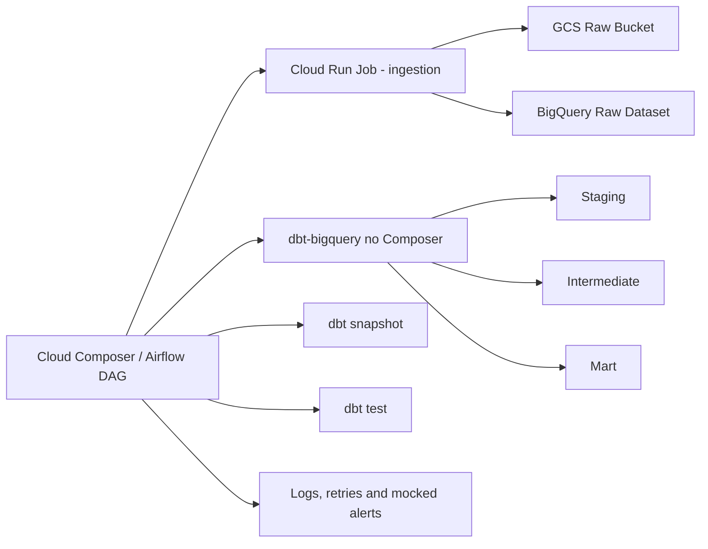

# gcp-iot-analytics-dbt

Repositorio que implementa uma plataforma de dados em GCP para monitoramento de consumo energetico de dispositivos IoT em predios inteligentes. O desenho foi evoluido para um fluxo mais proximo de producao: ingestao batch em `Cloud Run Jobs`, orquestracao em `Cloud Composer`, transformacao analitica via `dbt-bigquery` e base pronta para CI de deploy por dominio.

## Visao geral

O pipeline cobre quatro camadas:

1. `RAW`: arquivos JSONL gerados em Python e armazenados no `GCS`, com carga incremental no `BigQuery`
2. `STAGING`: limpeza, deduplicacao, tipagem e tratamento inicial de inconsistencias
3. `INTERMEDIATE`: regras de negocio e agregacoes reutilizaveis
4. `MART`: KPIs analiticos prontos para consumo

## Arquitetura



## Estrutura do repositorio

```text
.
├── composer/
│   ├── dags/
│   │   └── gcp_iot_analytics_dbt/
│   │       ├── iot_energy_pipeline.py
│   │       └── dbt_project/
│   ├── plugins/
│   └── data/
├── integrations/
│   └── iot_energy_ingestion/
├── infra/
│   └── terraform/
├── docs/
└── .github/
    └── workflows/
```

## Decisoes tecnicas e trade-offs

- `Cloud Run Jobs` foi escolhido para ingestao porque o workload e batch, finito e agendado. Trade-off: exige pipeline de container, versionamento de imagem e estrategia de deploy.
- `Cloud Composer` foi mantido para orquestracao porque o projeto precisa coordenar dependencias explicitas entre ingestao e transformacao. Trade-off: maior custo fixo e operacao mais pesada.
- `dbt-bigquery` executa as camadas analiticas diretamente no BigQuery. Trade-off: o ambiente do Composer precisa ter as dependencias Python do dbt instaladas.
- `composer/` agora representa o artefato sincronizado para o bucket do Composer. Trade-off: exige disciplina de layout, mas melhora o fluxo de CI/CD.
- `BigQuery` segue como warehouse principal pelas capacidades de particionamento, clustering e boa integracao com dbt. Trade-off: custo por scan precisa ser controlado com incremental e filtros por particao.

## Fluxo operacional

1. A DAG em `composer/dags/gcp_iot_analytics_dbt/` executa um `Cloud Run Job` com o codigo da pasta `integrations/iot_energy_ingestion/`.
2. O job gera eventos IoT sinteticos com problemas reais de qualidade.
3. O job grava o arquivo bruto no `GCS`.
4. O job faz `load append` no `BigQuery` raw particionado.
5. A DAG executa `dbt deps`, `dbt run`, `dbt snapshot` e `dbt test` usando o projeto dbt que esta no proprio bucket do Composer.
6. A DAG publica logs e alertas mockados.

## Como rodar localmente

### Pre-requisitos

- Python 3.11+
- Docker
- `dbt-bigquery`
- credenciais GCP com permissao em GCS e BigQuery
- variaveis de ambiente:
  - `GCP_PROJECT_ID`
  - `GCP_REGION`
  - `BQ_DATASET_RAW`
  - `BQ_DATASET_ANALYTICS`
  - `GCS_RAW_BUCKET`

### 1. Ingestao local

```powershell
cd integrations/iot_energy_ingestion
python -m venv .venv
.venv\Scripts\Activate.ps1
pip install -r requirements.txt
python run_ingestion.py --execution-date 2026-04-26T10:00:00 --output-dir data
```

### 2. Build da imagem de ingestao

```bash
cd integrations/iot_energy_ingestion
docker build -t us-central1-docker.pkg.dev/<project-id>/iot-platform/iot-ingestion:latest .
```

### 3. dbt local

```bash
cd composer/dags/gcp_iot_analytics_dbt/dbt_project
pip install dbt-bigquery
dbt deps
dbt debug --profiles-dir .
dbt run --profiles-dir .
dbt snapshot --profiles-dir .
dbt test --profiles-dir .
dbt docs generate --profiles-dir .
```

### 4. Composer

Sincronize a pasta `composer/` para o bucket do Composer, respeitando a estrutura `dags/`, `plugins/` e `data/`. O ambiente deve instalar os pacotes descritos em `composer/requirements-composer.txt`.

## CI/CD

O repositorio inclui workflows iniciais em `.github/workflows/`:

- `composer-sync.yml`: sincroniza `composer/dags`, `composer/plugins` e `composer/data` para o bucket do Composer quando houver mudancas em `composer/**`
- `terraform.yml`: executa `terraform fmt`, `terraform init -backend=false` e `terraform validate` quando houver mudancas em `infra/terraform/**`
- `iot-energy-ingestion-image.yml`: faz build, push e atualizacao da imagem do `Cloud Run Job` quando houver mudancas em `integrations/iot_energy_ingestion/**`
- `dbt-ci.yml`: valida o projeto dbt com `dbt deps`, `dbt parse` e `dbt compile` quando houver mudancas no projeto analitico
- `python-ci.yml`: executa testes unitarios da integracao e smoke check de sintaxe Python em PR e push

Segredos esperados no GitHub Actions:

- `GCP_WORKLOAD_IDENTITY_PROVIDER`
- `GCP_CI_SERVICE_ACCOUNT`
- `COMPOSER_DAG_BUCKET`
- `GCP_PROJECT_ID`
- `GCP_REGION`
- `ARTIFACT_REGISTRY_REPOSITORY`
- `IOT_ENERGY_INGESTION_JOB_NAME`

## Infraestrutura

O Terraform provisiona:

- bucket raw no `GCS`
- datasets raw e analytics no `BigQuery`
- `Artifact Registry` para a imagem do job
- `Cloud Run Job` para ingestao
- `Cloud Composer` para orquestracao
- service accounts e IAM basicos para Composer e Cloud Run

## Otimizacao de custo no BigQuery

- tabelas particionadas por `event_date` ou `timestamp`
- clustering por `building_id`, `device_id` e `status`
- modelos incrementais com janela de reprocessamento para late arriving data
- filtros em `is_incremental()` para evitar full scan
- armazenamento raw em `GCS` para replay barato

## Estimativa de custos

Cenario de laboratorio:

- `GCS`: poucos MB por dia, custo muito baixo
- `BigQuery storage`: abaixo de 10 GB na simulacao
- `BigQuery compute`: `dbt run/test/snapshot` com particionamento e incremental tende a manter scans em faixa baixa
- `Cloud Run Jobs`: custo proporcional a execucoes e CPU/memoria do job
- `Composer`: principal componente de custo fixo da arquitetura

Trade-off importante:

- `Composer` deixa a arquitetura mais crivel para ambientes enterprise, mas aumenta bastante o custo mensal comparado a alternativas mais serverless.

## Problemas reais simulados

- duplicidade por reenvio do dispositivo
- valores nulos
- consumo negativo
- eventos atrasados
- gaps de conectividade

## Limitacoes

- alertas continuam mockados em log
- o workflow de imagem cobre a integracao atual, mas um projeto com varias integracoes pode evoluir para uma estrategia matrix ou gerador de pipelines
- o ambiente Composer descrito em Terraform depende de rede, APIs e quotas disponiveis na conta GCP
- o CI de dbt valida estrutura e compilacao, mas nao executa `dbt run/test` contra um BigQuery real

## Melhorias futuras

- acoplar Cloud Monitoring e notificacoes reais
- adicionar semantic layer e camada de serving para BI
- incluir testes de contrato e observabilidade mais avancada
